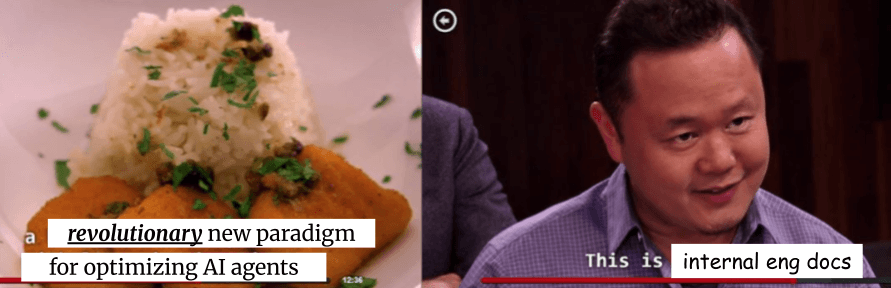

.. _How to Make Your Developer Documentation Work with LLMs: https://fusionauth.io/blog/llms-for-docs
.. _llms.txt: https://llmstxt.org
.. _Rules: https://docs.cursor.com/context/rules
.. _Claude Code Best Practices: https://www.anthropic.com/engineering/claude-code-best-practices
.. _Software in the era of AI: https://youtu.be/LCEmiRjPEtQ
.. _Agents.md Guide for OpenAI Codex: https://agentsmd.net
.. _Cursor 3-minute demo: https://youtu.be/LR04bU_yV5k
.. _Claude Code: https://docs.anthropic.com/en/docs/claude-code/overview
.. _Cursor: https://docs.cursor.com/welcome
.. _searchtools.txt: ../../_static/searchtools.txt
.. _searchtools.md: ../../_static/searchtools.md
.. _partial autonomy: https://youtu.be/LCEmiRjPEtQ?t=1289
.. _burden of proof: https://en.wikipedia.org/wiki/Burden_of_proof_(law)
.. _Agents.md: https://agentsmd.net
.. _system prompt: https://help.flintk12.com/en/articles/9025167-what-is-a-system-prompt
.. _Manage Claude's memory: https://docs.anthropic.com/en/docs/claude-code/memory
.. _Prompt iteration strategies: https://developers.google.com/machine-learning/resources/prompt-eng#prompt_iteration_strategies
.. _Agents.md Example: https://agentsmd.net/#example
.. _Diataxis: https://diataxis.fr
.. _how-to guide: https://diataxis.fr/how-to-guides/
.. _reference: https://diataxis.fr/reference/
.. _Share with your team: https://www.youtube.com/live/6eBSHbLKuN0?t=1043s
.. _Memory & project docs: https://github.com/openai/codex?tab=readme-ov-file#memory--project-docs
.. _contextFileName: https://github.com/google-gemini/gemini-cli/blob/3a369ddec3b226dea9d1a9dcc3bae048310edffd/docs/cli/configuration.md?plain=1#L36
.. _path\:CLAUDE.md: https://github.com/search?q=path%3ACLAUDE.md&type=code
.. _Gemini CLI: https://github.com/google-gemini/gemini-cli
.. _Aider: https://aider.chat/
.. _Windsurf: https://windsurf.com/
.. _Copilot: https://github.com/features/copilot

.. _agents:

==================
Docs for AI agents
==================

What are docs for AI agents? How are they different than internal eng docs? Do
we really have to maintain the agent docs and eng docs as separate docs sets?
This page contains my notes on these questions.

Scope:

* I work on *developer* docs i.e. docs for software engineers. I don't know
  how relevant AI agents are for technical writers in other industries or
  domains.

* I'm thinking specifically about docs for AI *agents*. I'm not
  sure that an all-encompassing "docs for AI best practices" exists. The way
  that we optimize docs for RAG-based chatbots (for example) is probably
  different than the way we optimize docs for AI agents.

-----------------
Internal eng docs
-----------------

I'm going to reference this type of docs a lot, so let me define the term now
and explain why these docs are important to the agent docs discussion.

**Internal eng docs** are the docs that engineering teams write for their own
use. The goal is to share knowledge and standardize contributions across the team.
E.g. an RFC explaining a key design decision, a guide explaining how to build
the project, a tutorial explaining how to contribute your first patch, etc. In
open source these types of docs are often called "contributor docs".

As the meme at the start of the post suggests, my hunch is that agent docs are
largely the same thing as internal eng docs. Yet the agent providers are
steering us towards maintaining them as separate docs sets. I worry that having
the agent docs divorced from the internal eng docs will result in a lot of
duplicated and contradictory information over the long run.

.. _agents-background:

---------
AI agents
---------

As a software developer, your primary interface for interacting with an AI
agent is through a chat interface that's been bolted onto your CLI (e.g.
`Claude Code`_, `Gemini CLI`_, `Aider`_, etc.) or IDE (e.g. `Cursor`_,
`Windsurf`_, `Copilot`_, etc.). The power of AI agents is their
ability to combine LLM capabilities with **tools** like web search and
``grep``.

Example
=======

Suppose that you need to understand the history of a file
in your codebase. With a single prompt like this:

.. code-block:: text

   look through the git and github history of
   searchtools.js and summarize the evolution
   of the file

The agent will:

* Run the relevant ``git`` commands in your terminal
* Fetch the contents of all GitHub issues mentioned in the commits
* Synthesize the information with an LLM
* Write the summary to a file

This really works! See `searchtools.txt`_ for an example of Claude Code
working through this problem and `searchtools.md`_ for the generated
summary.

----------
Agent docs
----------

Agent docs are a way to get better results from the agents. Agent docs
make the agent output more consistent, more aligned with your codebase
conventions, and more accurate.

Example
=======

When first trying out Claude Code (CC) on this website's repository, I
instructed CC to build the site. CC searched through the codebase and made a
reasonable (but incorrect) guess:

.. code-block:: text

   > build the website

   ● I'll build the website for you. Let me first check what build system
     is being used and then run the build command.

   ● Read(package.json)
     ⎿  Error: File does not exist.

   ● List(.)
     ⎿  Listed 166 paths (ctrl+r to expand)

   ● This is a Sphinx documentation website using Bazel as the build system.
     Let me run the build command.

   ● Bash(bazel build //...)
     ⎿  Running…

CC correctly determined that this is a :ref:`Sphinx site built with Bazel
<sphazel-tutorial>`, but it got the specific build command wrong.  After adding
the correct build command to an agent doc, CC now always builds the site
correctly, even if my prompt is simply ``build``.

Implementation
==============

Suppose that you want to spin up agent docs for your project. Here's what you do.

The agent providers look for these docs in the root directory of your project:

* Claude Code: ``//CLAUDE.md``
* Gemini CLI: ``//GEMINI.md``
* Codex CLI: ``//AGENTS.md``

(``//`` is shorthand for "the root directory of your project". E.g. if
your project is located at ``~/repo/app`` then ``//AGENTS.md`` resolves
to ``~/repo/app/AGENTS.md``.)

I hope the agent providers standardize around the generic ``AGENTS.md`` name.
It seems like all of these files serve the same purpose. There's no need to
have a product-specific filename like ``CLAUDE.md`` or ``GEMINI.md``. It looks
like Gemini CLI allows you to configure the filename via `contextFileName`_.
I don't see a way to configure the filename in Claude Code.

I'll call this the **project agent doc**.

Whenever the agent needs to make an LLM API call, it prepends the project agent
doc in its entirety as a `system prompt`_. For example, if my ``AGENTS.md`` file
contains ``foo`` and my current command to the agent is ``bar``, then the
underlying API call looks something like this:

.. code-block:: py

   response = client.responses.create(
       model="gpt-4.1",
       input=[
           {
               "role": "developer",
               "content": "foo"
           },
           {
               "role": "user",
               "content": "bar"
           }
       ]
   )

I couldn't find any evidence that the agents do any further processing or
analysis of the agent docs beyond this automated prompt engineering.
Please correct me if I'm wrong.

The project agent doc is always prepended to the API calls no matter what,
so it seems important to keep the project agent doc highly curated.

You can also create **subdirectory agent docs**. These agent docs are
only used when the agent does something that involves that subdirectory.
E.g. ``//docs/AGENTS.md`` is only added to the system prompt when the
agent is doing stuff in the ``//docs`` directory.

You can also create a **user agent doc** in your home directory. This
agent doc is for truly global workflows that you use in all of your projects.

As to the contents within an ``AGENTS.md`` file, it's just basic
Markdown. In terms of `Diataxis`_ doc types, the content is a mix
between `how-to guide`_ and `reference`_. See `AGENTS.md Example`_.
See also the GitHub search results for `path:CLAUDE.md`_ for a bunch of
real-world examples.

References:

* `Share with your team`_ 
* `Memory & project docs`_
* `Manage Claude's memory`_
* `Rules`_

-------------------------
Gotta keep 'em separated?
-------------------------

As mentioned before, the current design of agent docs is steering us towards
maintaining the agent docs and the internal eng docs as separate docs sets.
The agent docs must have a specific filename, and the location of the agent
docs is very significant. My hunch is that the agent providers are steering
us towards a world of duplicated information, but I'm not decided yet. Here
are some arguments for and against keeping the docs sets separate.

For:

* Writing style. In agent docs, using all caps might be an effective way to
  emphasize a particular instruction. In internal eng docs, this might come off
  rude or distracting.

* Conciseness vs. completeness. In agent docs, you likely need to keep the content highly curated.
  If you put in too much content, you'll blast through your API quotas quickly and will
  probably reduce LLM output quality. In internal eng docs, we ideally aim for 100%
  completeness. I.e. every important design decision, API reference, workflow,
  etc. is documented somewhere.

* Differing knowledge needs. The information that LLMs need help with is not the same as
  the information that human engineers need help with. For example, Gemini 2.5 Pro
  has pretty good built-in awareness of Pigweed's C++ Style Guide. I tested that
  assertion by invoking the Gemini API and instructing it ``Recite the Pigweed
  C++ Guide in its entirety``. It did not recite in full, but it gave a detailed
  summary of all the points. So the Gemini 2.5 Pro API was either trained on the style
  guide, or it's able to retrieve the style guide when needed. Therefore, it's
  not necessary to include the full style guide as ``AGENTS.md`` context.
  (Credit to Keir Mierle for this idea.)

Against:

* Duplication. Conceptually, agent docs are a subset of internal eng docs.
  The underlying goal is the same. You're documenting workflows and knowledge
  that's important to the team. But now you need to maintain that same information
  in two different doc sets.

I'm probably missing a lot of arguments for and against. Please help me think up more!

I'll wrap up this post with some potential solutions to the problem.

Synchronize
===========

Maybe we can use AI agents themselves to keep the agent docs in-sync with the
internal eng docs? It sounds feasible, but I'm not sure how much it will
actually happen in practice. Time will tell.

Combine
=======

"Combining" means that the agent docs and internal eng docs are literally one
and the same. I only see two ways to do this:

* Ditch the agent docs completely. When you need to do some particular task,
  feed in the relevant internal eng docs as context for the agent. Hack
  together a kludge that forbids the agents from accessing ``AGENTS.md`` files.
* Ditch the internal eng docs completely. Do not allow internal eng docs
  outside of agent docs. Internal eng content can only be documented in agent docs.

.. _agents-colocate:

Colocate
========

Embed the agent docs as comments within the internal eng docs. Use an automated
script to extract the comments from the internal eng docs and copy them to the
``AGENTS.md`` files. I.e. the ``AGENTS.md`` files become a read-only build artifact.

E.g. this is your internal eng doc:

.. code-block:: markdown

   # Build the project

   ## Setup

   <!-- AGENT: Build the project: bazelisk build //... -->

   1. Install [Bazelisk](…).
   2. …

Your automated script extracts the comment for the agent and places this into your
project agent doc:

.. code-block:: markdown

   Build the project: bazelisk build //...

Or maybe the agents get smart enough to look for these comments themselves?

There might actually already be a low-friction way to do colocation. Imagine
that your project agent doc only contains these instructions:

.. code-block:: markdown

   Grep the codebase for ``<!-- AGENT: * -->``
   comments that are relevant to your current
   task.

Import
======

A lot of the agent providers support an ``@`` syntax within agent docs that allows
you to import other files.

.. code-block:: text

   Consult @CONTRIBUTING.md for project development guidance.

(Credit to Brandon Bloom for this idea.)
