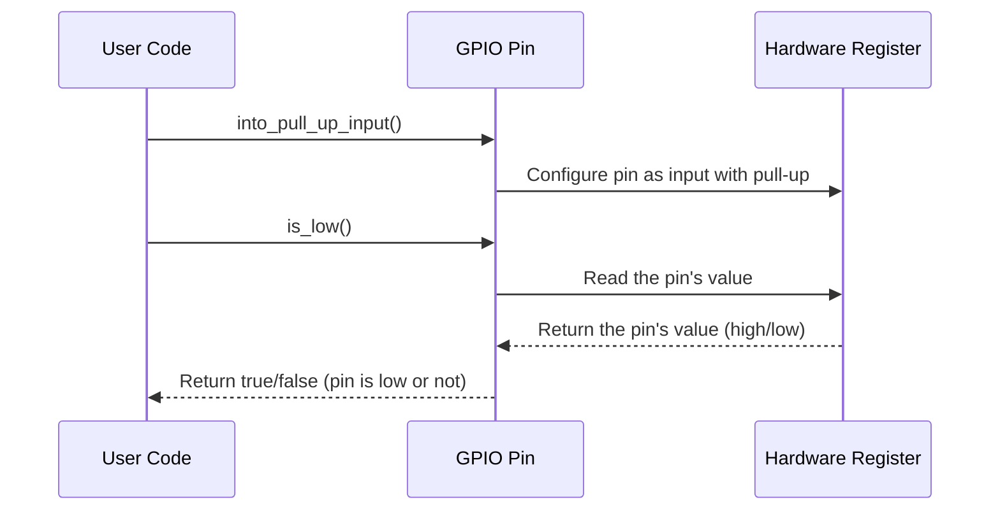

# Chapter 4: GPIO (General Purpose Input/Output) Pins

In the previous chapter, [Display](03_display_.md), we learned how to control the micro:bit's LED matrix to display patterns and messages. But what if we want to *interact* with the outside world? What if we want to connect a button, a sensor, or a motor to our micro:bit? That's where GPIO pins come in!

Imagine you want to build a simple game where pressing a button makes an LED light up. You need a way for the micro:bit to "sense" when the button is pressed and then "tell" the LED to turn on. GPIO pins are the micro:bit's way of doing just that.

**What are GPIO Pins?**

GPIO stands for General Purpose Input/Output. These pins are like the micro:bit's "wires" that you can use to connect to external components. You can configure them to be either:

*   **Inputs:** To *read* signals from external components (like a button being pressed).
*   **Outputs:** To *send* signals to external components (like turning on an LED).

Think of them as tiny doors that let information flow in (input) or out (output) of the micro:bit.

**Key Concepts**

1.  **Pins on the Edge Connector:** The GPIO pins are located on the edge connector of the micro:bit (the gold pads along the bottom). These are the "connection points" for your external components.

2.  **Input Mode:** When a pin is configured as an input, the micro:bit can detect whether the voltage on the pin is high (usually representing "on" or "pressed") or low (usually representing "off" or "not pressed").

3.  **Output Mode:** When a pin is configured as an output, the micro:bit can set the voltage on the pin to be either high or low. This can be used to control external components.

4.  **`microbit::gpio` Module:** The `microbit` crate provides a module called `gpio` that gives you easy access to the GPIO pins using named constants. This makes your code more readable (e.g., `gpio::P0` instead of just a number).

**A Simple Use Case: Button Press Detection**

Let's build a simple program that detects when a button connected to pin P0 is pressed and then displays a message on the display.

**Example Setup (Hardware)**

1.  You'll need a push button.
2.  Connect one side of the button to P0 on the micro:bit.
3.  Connect the other side of the button to GND (ground) on the micro:bit.

**The Code**

First, we get the `Board` and the `gpio` module:

```rust
use microbit::Board;
use microbit::gpio;

fn main() -> ! {
    let board = Board::take().unwrap();

    loop {}
}
```

**Explanation:**

*   `use microbit::gpio;`: This line imports the `gpio` module, allowing us to use named GPIO pins.
*   `let board = Board::take().unwrap();`: We get the `Board` instance as usual.

Now, we get the `Pins` struct from the `Board` and configure the pin P0 as an input:

```rust
use microbit::Board;
use microbit::gpio;
use embedded_hal::digital::v2::InputPin; // Import the InputPin trait

fn main() -> ! {
    let board = Board::take().unwrap();
    let pins = board.pins;

    // Configure pin P0 as an input with a pull-up resistor.
    let button_pin = pins.p0.into_pull_up_input();

    loop {}
}
```

**Explanation:**

*   `let pins = board.pins;`: This line gets the `pins` field from the `board` object, which gives us access to all the GPIO pins.
*  `use embedded_hal::digital::v2::InputPin;`: We need to import the `InputPin` trait from the `embedded-hal` crate to work with input pins. This is an interface defined in [HAL (Hardware Abstraction Layer)](05_hal__hardware_abstraction_layer__.md).
*   `let button_pin = pins.p0.into_pull_up_input();`: This configures pin P0 as an input.
    *   `pins.p0` accesses the pin P0.
    *   `into_pull_up_input()` configures the pin as an input with a pull-up resistor. A "pull-up" resistor ensures that the pin is HIGH by default, and goes LOW when the button is pressed. This is a common configuration for buttons.

Finally, we can read the button's state and display a message on the display:

```rust
use microbit::Board;
use microbit::gpio;
use embedded_hal::digital::v2::InputPin;
use embedded_hal::delay::DelayNs;

fn main() -> ! {
    let board = Board::take().unwrap();
    let pins = board.pins;
    let mut display = board.display;
    let button_pin = pins.p0.into_pull_up_input();

    loop {
        // Check if the button is pressed (low signal)
        if button_pin.is_low().unwrap() {
            // Display a message
            display.show("PRESSED!".into());
        } else {
            // Clear the display
            display.clear();
        }

        board.timer.delay_ms(100); // Small delay to avoid busy-waiting
    }
}
```

**Explanation:**

*   `let mut display = board.display;`: We get the `display` from the `board` object.
*   `loop { ... }`: This creates an infinite loop to continuously check the button's state.
*   `if button_pin.is_low().unwrap() { ... }`: This checks if the button is pressed.
    *   `button_pin.is_low().unwrap()` returns `true` if the pin is low (button pressed) and `false` otherwise. The `.unwrap()` handles the potential error case.
*   `display.show("PRESSED!".into());`: If the button is pressed, we display "PRESSED!" on the LED matrix. `.into()` converts the string literal into a `Image`.
*   `display.clear();`: If the button is not pressed, we clear the display.
*   `board.timer.delay_ms(100);`: This introduces a small delay to prevent the program from consuming too much processing power.

When you run this code and press the button, you should see "PRESSED!" appear on the micro:bit's display! When you release the button, the display will clear.

**Internal Implementation: How `into_pull_up_input()` and `is_low()` Work**

Let's take a simplified look at what happens when you call `into_pull_up_input()` and `is_low()`.



1.  **User Code:** Your program calls `into_pull_up_input()` to configure the pin and then `is_low()` to read its value.
2.  **`GPIO Pin`:**  The GPIO Pin abstraction receives the configuration request and the read request.
3.  **Hardware Register:** The `GPIO Pin` communicates with the hardware register in the microcontroller to configure the pin as an input with a pull-up resistor or to read the current value of the pin. The `into_pull_up_input()` and `is_low()` will be abstracted by [HAL (Hardware Abstraction Layer)](05_hal__hardware_abstraction_layer__.md).
4.  The hardware register returns the pin's value (high or low) to the `GPIO Pin`, which then returns `true` (if the pin is low) or `false` (if the pin is high) to your code.

**Code Snippet (Simplified)**

Here's a highly simplified (and incomplete) view of what `into_pull_up_input()` and `is_low()` *might* look like inside the `microbit` crate.  *This is for illustrative purposes only and doesn't represent the actual implementation.*

```rust
// Inside the microbit crate (simplified example)

pub struct Pin {
    // ... some internal data ...
}

impl Pin {
    pub fn into_pull_up_input(self) -> Self {
        // This is VERY simplified!
        // The actual code will configure hardware registers via HAL.

        // 1. Configure the pin as an input
        println!("Configuring pin as input with pull-up resistor");

        // 2. Update the internal state of the pin
        // ...

        self // Return the configured pin
    }

    pub fn is_low(&self) -> Result<bool, ()> {
        // This is VERY simplified!
        // The actual code will read from hardware registers via HAL.

        // 1. Read the pin's value from the hardware
        let value = read_from_hardware(); // Dummy function

        // 2. Return true if the pin is low, false otherwise
        if value == 0 {
            Ok(true) // Pin is low
        } else {
            Ok(false) // Pin is high
        }
    }
}

fn read_from_hardware() -> u8 {
    // Dummy function to simulate reading from hardware
    // In reality, this will interact with memory-mapped registers.
    0 // Simulate the button being pressed (low signal)
}
```

**Explanation:**

*   `into_pull_up_input()`: This function configures the pin as an input with a pull-up resistor. In reality, it would manipulate hardware registers using the HAL.
*   `is_low()`: This function reads the pin's value from the hardware.  In reality, it would read from memory-mapped registers using the HAL and return true if the pin is low (0) and false otherwise.
* `read_from_hardware()`: A dummy function that simulates the read from the hardware and is used for demonstration purposes.

**In Summary**

GPIO pins are essential for interacting with the outside world using your micro:bit. You can configure them as inputs to read signals from sensors or buttons, or as outputs to control LEDs, motors, and other devices. The `microbit::gpio` module provides named pins for easy access, and functions like `into_pull_up_input()` and `is_low()` allow you to configure and read the state of the pins.

In the next chapter, we'll explore [HAL (Hardware Abstraction Layer)](05_hal__hardware_abstraction_layer__.md), which provides a unified interface to access all hardware peripherals such as `GPIO`, `Display` and `Timer`.


---

Generated by [AI Codebase Knowledge Builder](https://github.com/The-Pocket/Tutorial-Codebase-Knowledge)