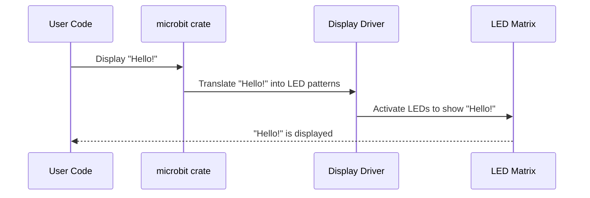

# Chapter 1: microbit (crate)

Welcome to the exciting world of programming your BBC micro:bit with Rust! Think of this tutorial as your roadmap. In this first chapter, we'll explore the `microbit` crate, which is the foundation for everything we'll do.

**Why do we need the `microbit` crate?**

Imagine you want to turn on an LED on your micro:bit. You could try to directly manipulate the electronic signals yourself, but that's complicated and error-prone. The `microbit` crate is like a translator. It takes your simple instructions ("turn on LED") and converts them into the low-level commands that the micro:bit's hardware understands.

Think of it like this: you speak English (Rust code), and the micro:bit speaks "hardware language." The `microbit` crate acts as the interpreter between the two.

**A Simple Use Case: Displaying "Hello!"**

Let's say we want to display "Hello!" on the micro:bit's LED matrix. Without the `microbit` crate, we'd have to deal with memory addresses, registers, and other low-level details. But *with* the crate, it becomes much easier.

**What is the `microbit` crate?**

At its core, the `microbit` crate is a *library* of code that provides:

*   **Drivers:** Code to control specific hardware components like the LEDs, buttons, and sensors. Think of these as individual "apps" that control each part of the micro:bit.
*   **Abstractions:** Simplifications of complex hardware interactions. Instead of writing dozens of lines to turn on an LED, you might just call a single function.
*   **A Starting Point:** Sets up the basic environment for your Rust code to run on the micro:bit.

**Micro:bit V1 vs. V2**

Just like smartphones have different versions, so does the micro:bit! There's the original V1 and the newer V2. Each version has slightly different hardware. Because of these hardware differences, we need different "operating systems" for each.

*   **`microbit` crate:** This is specifically for the *original* micro:bit (V1).
*   **`microbit-v2` crate:** This is designed for the newer micro:bit V2.

It's *crucial* to use the correct crate for your micro:bit version! Using the wrong one will lead to errors and your code won't work. You can identify your micro:bit version by looking at the back of the board.

**How to use the `microbit` crate (Example)**

Here's a simplified example of how you might use the `microbit` crate (we'll see the full code later):

```rust
// This line imports the microbit crate (we're assuming it's V1 here)
use microbit::hal::pac;

fn main() -> ! {
    // We'll learn what Board does in the next chapter!
    // This is just to show how to import and use a module from this crate.
    let _board = microbit::Board::take().unwrap();

    loop {}
}
```

**Explanation:**

1.  `use microbit::hal::pac;`:  This line is like saying, "I want to use some code from the `microbit` crate". Specifically, we are importing `pac` from `hal`. The `hal` module itself and `pac` module will be explained in later chapters ([HAL (Hardware Abstraction Layer)](5.md)).
2. `let _board = microbit::Board::take().unwrap();`:  This line gets the Board. The `Board` struct is defined in `microbit` crate, and we will cover this in [Board](2.md).

**Under the Hood (Simplified)**

Let's imagine a very simplified scenario of how displaying "Hello!" might work internally.



1.  **User Code:** This is your Rust program, where you want to display "Hello!".
2.  **`microbit` crate:** Your code calls functions within the `microbit` crate.
3.  **Display Driver:** A specific part of the crate responsible for controlling the LED matrix ([Display](3.md) will explain this more). It understands how to translate the text into patterns of LEDs.
4.  **LED Matrix:** The actual grid of LEDs on the micro:bit.

The `microbit` crate handles the complex communication with the hardware, so you don't have to worry about the nitty-gritty details.

**Implementation Snippet (Very Basic)**

While we won't dive deep into the internal code yet, here's a tiny example of what a function *might* look like inside the `microbit` crate (simplified for clarity):

```rust
// Inside the microbit crate (simplified example)

pub fn display_character(character: char) {
    // This is VERY simplified!  The actual code is much more complex.
    // But it gives you an idea of what might happen.

    // ... (Code to convert the character to an LED pattern) ...

    // ... (Code to send the LED pattern to the LED matrix) ...
}
```

**Explanation:**

This function, `display_character`, takes a character (like 'H') as input. Inside the function (which is hidden inside the `microbit` crate), there would be code to:

1.  Determine which LEDs need to be turned on to form the letter 'H'.
2.  Send the appropriate signals to the LED matrix to light up those LEDs.

**In Summary**

The `microbit` crate is your essential tool for programming the BBC micro:bit in Rust. It provides a user-friendly interface to the micro:bit's hardware, allowing you to focus on creating exciting projects without getting bogged down in low-level details. Remember to choose the correct crate (`microbit` for V1, `microbit-v2` for V2) for your board.

In the next chapter, we'll explore the [Board](2.md) abstraction, which represents the micro:bit itself and allows us to access its various components.


---

Generated by [AI Codebase Knowledge Builder](https://github.com/The-Pocket/Tutorial-Codebase-Knowledge)