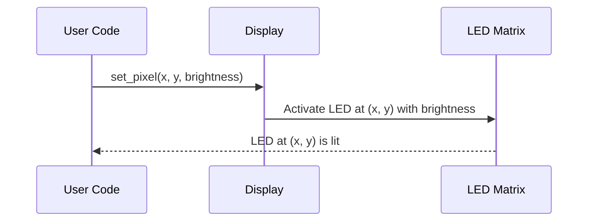

# Chapter 3: Display

In the previous chapter, [Board](02_board_.md), we learned how to get the `Board` object, which represents the micro:bit itself and provides access to its various components. Now, we'll focus on one of the most exciting components: the `Display`!

**What is the `Display` and why do we need it?**

Imagine you want to show a message to someone using your micro:bit. How do you do it? You use the `Display`!

The `Display` is the abstraction that controls the 5x5 LED matrix on the micro:bit. Think of it as the "screen" of your micro:bit.  It lets you turn LEDs on and off, draw patterns, and display text, allowing your micro:bit to communicate information to the user.

**A Simple Use Case: Lighting up a single LED**

Let's say you want to light up the very first LED (the one in the top-left corner) on your micro:bit. How do you do it? That's where the `Display` comes in! Without the `Display`, you'd have to mess around with low-level hardware details. But with the `Display`, it's as simple as telling it which LED to light up.

**Key Concepts of the `Display`**

The `Display` is like a canvas made of LEDs. Here are the key things to understand:

1.  **LED Matrix:** The `Display` controls a 5x5 grid of LEDs. Each LED can be turned on or off, and its brightness can be adjusted.

2.  **Coordinates:**  Each LED has a coordinate (x, y) to identify its position.
    *   x ranges from 0 to 4 (left to right).
    *   y ranges from 0 to 4 (top to bottom).
    *   So, (0, 0) is the top-left LED, and (4, 4) is the bottom-right LED.

3.  **Brightness:** Each LED's brightness can be set from 0 to 9.
    *   0 means the LED is off.
    *   9 means the LED is at its maximum brightness.

4. **Blocking vs. Non-Blocking:** There are two main ways to interact with the `Display`:
    *   **Blocking:**  When you call a function to update the display, the program waits until the display is updated *before* continuing. This is simpler for beginners.
    *   **Non-Blocking:**  The program tells the display to update, but *doesn't* wait. This allows you to do other things while the display is updating in the background, but it's a bit more complex.

**How to Use the `Display`**

Let's see how to use the `Display` to light up that top-left LED we talked about earlier.  We'll be using the *blocking* version for simplicity.

First, we need to get the `Board` and then the `Display` from the `Board`, just like in the previous chapter:

```rust
use microbit::Board;

fn main() -> ! {
    let board = Board::take().unwrap();
    let mut display = board.display;

    loop {}
}
```

**Explanation:**

*   `let board = Board::take().unwrap();`: We get the `Board` instance.
*   `let mut display = board.display;`: We get the `display` from the `board`. The `mut` keyword is important because we are going to modify the `display`.

Now, let's turn on the LED at coordinate (0, 0) with maximum brightness:

```rust
use microbit::Board;
use embedded_hal::delay::DelayNs;

fn main() -> ! {
    let board = Board::take().unwrap();
    let mut display = board.display;

    display.set_pixel(0, 0, 9); // Turn on the LED at (0, 0) with brightness 9

    board.timer.delay_ms(1000);

    loop {}
}
```

**Explanation:**

*   `display.set_pixel(0, 0, 9);`: This is the key line! It calls the `set_pixel()` function on the `display`.
    *   The first two arguments (`0, 0`) specify the x and y coordinates of the LED.
    *   The third argument (`9`) specifies the brightness.
*   `board.timer.delay_ms(1000);`: This pauses the program for 1000 milliseconds (1 second). Without this delay, the LED would only flash very briefly and you may not see it.

When you run this code on your micro:bit, you should see the top-left LED light up for one second!

**Displaying a Pattern**

You can also display a pattern by setting multiple pixels.  Let's create a simple "X" pattern:

```rust
use microbit::Board;
use embedded_hal::delay::DelayNs;

fn main() -> ! {
    let board = Board::take().unwrap();
    let mut display = board.display;

    display.set_pixel(0, 0, 9);
    display.set_pixel(1, 1, 9);
    display.set_pixel(2, 2, 9);
    display.set_pixel(3, 3, 9);
    display.set_pixel(4, 4, 9);
    display.set_pixel(4, 0, 9);
    display.set_pixel(3, 1, 9);
    display.set_pixel(2, 2, 9);
    display.set_pixel(1, 3, 9);
    display.set_pixel(0, 4, 9);

    board.timer.delay_ms(1000);

    loop {}
}
```

**Explanation:**

This code sets the brightness of several pixels to form an "X" shape on the LED matrix. Try running it to see the pattern!

**Internal Implementation: How `set_pixel()` Works**

Let's take a simplified look at what happens when you call `display.set_pixel()`.



1.  **User Code:** Your program calls `display.set_pixel(x, y, brightness)`.
2.  **`Display`:**  The `Display` receives the coordinates (x, y) and the brightness value.
3.  **LED Matrix:** The `Display` then sends the appropriate signals to the LED matrix to turn on the specified LED with the given brightness. The exact signal will be explained in [HAL (Hardware Abstraction Layer)](05_hal__hardware_abstraction_layer__.md).
4.  The LED lights up.

**Code Snippet (Simplified)**

Here's a simplified (and incomplete) view of what `set_pixel()` might look like inside the `microbit` crate.  *This is for illustrative purposes only and doesn't represent the actual implementation.*

```rust
// Inside the microbit crate (simplified example)

pub struct Display {
    // ... some internal data ...
}

impl Display {
    pub fn set_pixel(&mut self, x: u8, y: u8, brightness: u8) {
        // This is VERY simplified!
        // The actual code is much more complex.

        // 1. Check if the coordinates are valid (0-4)
        if x > 4 || y > 4 {
            return; // Invalid coordinates, do nothing
        }

        // 2. Convert the coordinates to an index in the LED matrix
        let index = x + y * 5;

        // 3. Set the brightness of the corresponding LED
        // ... (Code to send the brightness value to the LED matrix) ...
        // In reality, it will communicate via [HAL (Hardware Abstraction Layer)](05_hal__hardware_abstraction_layer__.md).

        println!("Setting pixel ({}, {}) to brightness {}", x, y, brightness); // Example output for demonstration
    }
}
```

**Explanation:**

1.  The `set_pixel` function takes the x and y coordinates and the brightness as input.
2.  It first validates the input to make sure the coordinates are valid, between 0 and 4.
3.  It calculates the index to use to set the brightness of the correct LED.
4.  Finally, there is a code to set the brightness of the LED.

**In Summary**

The `Display` abstraction allows you to easily control the micro:bit's LED matrix.  You can turn individual LEDs on and off, set their brightness, and create patterns. The `set_pixel()` function is a fundamental tool for interacting with the `Display`.

In the next chapter, we'll explore [GPIO (General Purpose Input/Output) Pins](04_gpio__general_purpose_input_output__pins_.md), which allow you to interact with external components and sensors.


---

Generated by [AI Codebase Knowledge Builder](https://github.com/The-Pocket/Tutorial-Codebase-Knowledge)