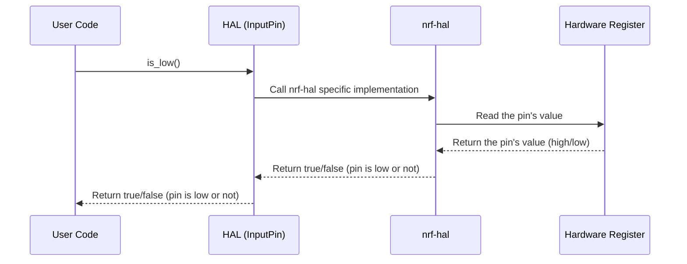

# Chapter 5: HAL (Hardware Abstraction Layer)

In the previous chapter, [GPIO (General Purpose Input/Output) Pins](4.md), we learned how to interact with the outside world by connecting buttons and sensors to the micro:bit. We used specific functions like `into_pull_up_input()` to configure the pins. But what if we want to switch to a newer micro:bit with slightly different hardware? Would we have to rewrite all our code? That's where the HAL (Hardware Abstraction Layer) comes in!

**What is the HAL and why do we need it?**

Imagine you're using a universal remote to control your TV, DVD player, and sound system. The remote doesn't need to know the specific details of each device; it just needs to send standardized commands like "power on" or "volume up". The HAL is like that universal remote for your micro:bit's hardware.

The HAL (Hardware Abstraction Layer) is a layer of code that sits between your application and the low-level hardware. It provides a consistent interface to access the hardware, regardless of the specific hardware details. Think of it as a translator that allows you to write code that works on different micro:bit versions (or even completely different microcontrollers!) without needing to change the core logic. It abstracts away the specifics of the hardware, providing a more general and easier-to-use interface.

**A Central Use Case: Blinking an LED**

Let's say we want to blink an LED connected to a GPIO pin. Without the HAL, we'd have to directly manipulate hardware registers, which are different for each microcontroller. With the HAL, we can use a standard function to set the pin high or low, regardless of the underlying hardware.

**Key Concepts**

1.  **Abstraction:** The HAL hides the complexity of the underlying hardware. You don't need to know the memory addresses or register layouts.

2.  **Portability:**  HAL makes the code portable and reusable across different microcontrollers (to a certain extent). If you switch to a new micro:bit version, you might only need to change the HAL implementation, not your application code.

3.  **Standardized Interface:** The HAL provides a standardized set of functions for common hardware operations, such as reading and writing to GPIO pins, controlling the display, and using timers. The functions are defined by `embedded-hal` crate.

4.  **`nrf-hal` Crate:** The `microbit` crate builds upon the `nrf-hal` crate, which provides a HAL specifically for Nordic Semiconductor's nRF microcontrollers (the ones used in the micro:bit).

**How to Use the HAL**

Let's rewrite the button press detection example from the previous chapter, [GPIO (General Purpose Input/Output) Pins](4.md), to use the HAL.

First, let's recall the non-HAL version.

```rust
use microbit::Board;
use embedded_hal::digital::v2::InputPin;
use embedded_hal::delay::DelayNs;

fn main() -> ! {
    let board = Board::take().unwrap();
    let pins = board.pins;
    let mut display = board.display;
    let button_pin = pins.p0.into_pull_up_input();

    loop {
        if button_pin.is_low().unwrap() {
            display.show("PRESSED!".into());
        } else {
            display.clear();
        }

        board.timer.delay_ms(100);
    }
}
```

Now, let's focus on the `button_pin.is_low().unwrap()` part. `is_low()` is a method from `embedded_hal::digital::v2::InputPin`. The `embedded-hal` crate defines a standard set of traits (interfaces) for interacting with peripherals. The nrf52 (the microcontroller on the micro:bit) HAL implements these traits, making it possible to write code that is portable across different microcontrollers. Let's focus on `InputPin` trait here, where `is_low()` belongs to.

```rust
pub trait InputPin {
    /// Error type
    type Error;

    /// Is the input pin HIGH?
    fn is_high(&self) -> Result<bool, Self::Error>;

    /// Is the input pin LOW?
    fn is_low(&self) -> Result<bool, Self::Error>;
}
```

The HAL is already used in this code! `into_pull_up_input()` also makes use of HAL. The trait `embedded_hal::digital::v2::InputPin` is implemented for the `p0` pin of the `microbit::Board`.

Let's show how `DelayNs` trait (from `embedded_hal::delay`) is used for `board.timer.delay_ms(100)`.

```rust
pub trait DelayNs {
    /// Pause execution for at least `ns` nanoseconds.
    fn delay_ns(&mut self, ns: u32);

    /// Pause execution for at least `us` microseconds.
    fn delay_us(&mut self, us: u32);

    /// Pause execution for at least `ms` milliseconds.
    fn delay_ms(&mut self, ms: u32);

    /// Pause execution for at least `s` seconds.
    fn delay_s(&mut self, s: u32);
}
```

The Timer abstraction provided by the `microbit::Board` implements the `DelayNs` trait from `embedded_hal::delay`.

**Benefits of HAL**

*   **Code Reusability:** Code written using the HAL can be easily adapted to different microcontrollers that implement the same HAL traits.
*   **Simplified Development:** Developers don't need to learn the intricacies of each microcontroller's hardware.
*   **Improved Maintainability:** Changes to the underlying hardware are isolated within the HAL implementation, minimizing the impact on application code.

**Under the Hood: How the HAL Works**

Let's take a simplified look at how the HAL works when you call a function like `button_pin.is_low()`.



1.  **User Code:** Your program calls `button_pin.is_low()`.
2.  **HAL (InputPin):** The `is_low()` method is part of the `InputPin` trait in the HAL.
3.  **`nrf-hal`:** The HAL implementation for the nRF52 microcontroller (used in the micro:bit) is within the `nrf-hal` crate. The trait implementations in `nrf-hal` are called.
4.  **Hardware Register:** The `nrf-hal` reads the pin's value from the appropriate hardware register in the microcontroller.
5.  The hardware register returns the pin's value (high or low).
6.  The `nrf-hal` returns `true` or `false` to the HAL (InputPin), indicating whether the pin is low or not.
7.  The HAL then returns the result to your code.

**Code Snippet (Simplified)**

Here's a simplified (and incomplete) view of what the `InputPin` trait implementation might look like inside the `nrf-hal` crate. *This is for illustrative purposes only and doesn't represent the actual implementation.*

```rust
// Inside the nrf-hal crate (simplified example)

impl InputPin for GpioPin { // GpioPin is just a dummy example for GPIO
    type Error = (); // No error type in this example

    fn is_high(&self) -> Result<bool, Self::Error> {
        // Read the pin's value from the hardware register
        let value = self.read_register(); // This line read from hardware register

        Ok(value == 1) // Return true if the pin is high
    }

    fn is_low(&self) -> Result<bool, Self::Error> {
        // Read the pin's value from the hardware register
        let value = self.read_register(); // This line read from hardware register

        Ok(value == 0) // Return true if the pin is low
    }
}
```

**Explanation:**

*   `impl InputPin for GpioPin { ... }`: This line indicates that we are implementing the `InputPin` trait for a `GpioPin` struct (which represents a GPIO pin).
*   `fn is_high(&self) -> Result<bool, Self::Error> { ... }`: This is the implementation of the `is_high()` method from the `InputPin` trait. It reads the pin's value from the hardware register (using a placeholder function `self.read_register()`) and returns `true` if the pin is high (value == 1).
*   `fn is_low(&self) -> Result<bool, Self::Error> { ... }`: This is the implementation of the `is_low()` method. It reads the pin's value from the hardware register and returns `true` if the pin is low (value == 0).

**`pac` crate**

You may have seen `pac` (Peripheral Access Crate) in previous chapters, such as [microbit (crate)](1.md) and [Board](2.md). `pac` provides the lowest-level access to the microcontroller's peripherals. `nrf-hal` builds on top of `pac` to provide a more abstract and user-friendly interface.

**In Summary**

The HAL (Hardware Abstraction Layer) is a crucial abstraction that allows you to write portable and maintainable code for the micro:bit. It hides the complexity of the underlying hardware, providing a standardized interface for common hardware operations. By using the HAL, you can easily adapt your code to different micro:bit versions or even different microcontrollers. The `microbit` crate leverages the `nrf-hal` crate, which provides a HAL specifically for the nRF52 microcontroller used in the micro:bit.

In the next chapter, we'll explore further concepts.


---

Generated by [AI Codebase Knowledge Builder](https://github.com/The-Pocket/Tutorial-Codebase-Knowledge)