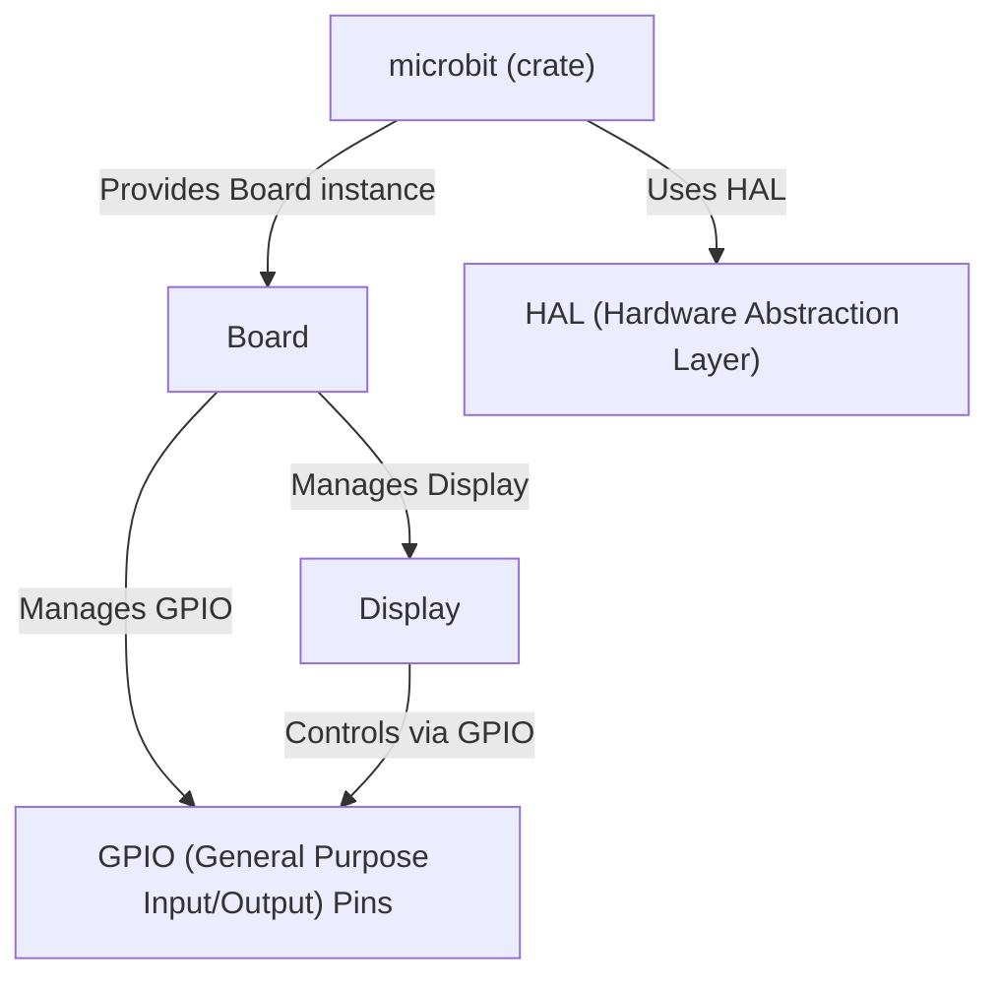

# Tutorial: microbit

The `microbit` crate provides a **Rust-based** environment for programming the BBC micro:bit. It acts as an *operating system* providing tools to interact with the micro:bit's hardware, such as the LED display, buttons, and sensors. It includes abstractions to simplify hardware interactions.

**Source Repository:** [None](None)

## Chapters

1. [microbit (crate)
](01_microbit__crate__.md)
2. [Board
](02_board_.md)
3. [Display
](03_display_.md)
4. [GPIO (General Purpose Input/Output) Pins
](04_gpio__general_purpose_input_output__pins_.md)
5. [HAL (Hardware Abstraction Layer)
](05_hal__hardware_abstraction_layer__.md)

---

Generated by [AI Codebase Knowledge Builder](https://github.com/The-Pocket/Tutorial-Codebase-Knowledge)