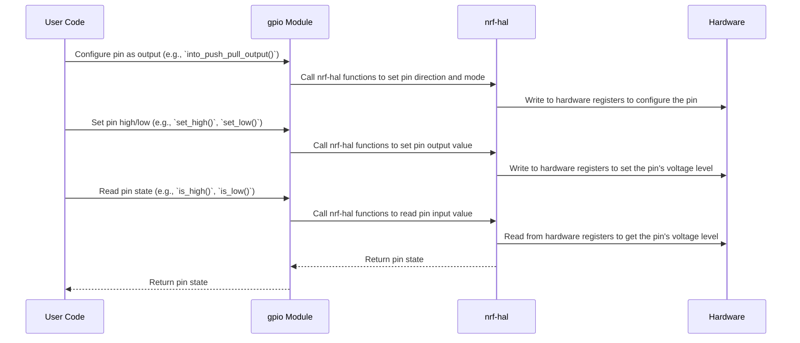

# Chapter 4: GPIO Module

Following our exploration of the [Non-Blocking Display](03_non_blocking_display_.md), this chapter dives into the GPIO (General Purpose Input/Output) module, a fundamental component for interacting with the physical world via the micro:bit.

## Motivation: Interacting with the Physical World

Imagine you're building a simple home automation system with your micro:bit. You want to control a relay to turn a light on and off based on the reading from a temperature sensor.  To do this, you need to be able to:

1.  **Read the state of the temperature sensor:** This involves configuring a GPIO pin as an input and reading the voltage level (or digital signal) from the sensor.
2.  **Control the relay:** This involves configuring a GPIO pin as an output and setting its voltage level high or low to activate or deactivate the relay.

The `microbit::gpio` module provides a structured and type-safe way to access and control the micro:bit's GPIO pins, simplifying these interactions with external components. Without this module, you'd have to directly manipulate hardware registers, which is error-prone and difficult to read.

**Use Case:** Reading the state of a button connected to a GPIO pin and turning on/off an LED connected to another GPIO pin based on the button press.

## Key Concepts

1.  **Pin Mapping:** The `gpio` module provides named access to the micro:bit's GPIO pins. Instead of referring to pins by their raw numbers (e.g., P0.00, P1.02), you can use more descriptive names like `board.pins.p0_23`, which represents physical pin 23 on port 0. This enhances code readability.

2.  **Pin Configuration:** GPIO pins can be configured as either inputs or outputs.
    *   **Inputs:** Read the voltage level applied to the pin.  Often used for reading sensor data or button presses.
    *   **Outputs:** Set the voltage level of the pin.  Often used for controlling LEDs, relays, or other actuators.

3.  **Pin Modes:** Pins can operate in different modes, influencing their behavior:
    *   **Input:** Configures the pin for reading external signals.
    *   **Output:** Configures the pin for driving external loads.
    *   **Pull-up/Pull-down:** Configures an internal resistor to pull the pin's voltage level high (pull-up) or low (pull-down) when no external signal is applied. This prevents the pin from floating and causing unpredictable behavior.

4.  **Type Safety:** The `gpio` module leverages Rust's type system to ensure that pins are used correctly. For example, you cannot accidentally write to an input pin, or configure an output pin as an input without first changing its type.

## Using the GPIO Module

Let's illustrate how to use the `gpio` module with a simple example: reading the state of button A and controlling an LED.

```rust
#![no_std]
#![no_main]

use panic_halt as _;

#[cfg(feature = "v1")]
use microbit::{Board, hal::gpio::{Level, Pin, Input, Output, PushPull}};

#[cfg(feature = "v2")]
use microbit_v2::{Board, hal::gpio::{Level, Pin, Input, Output, PushPull}};

use cortex_m_rt::entry;

#[entry]
fn main() -> ! {
    #[cfg(feature = "v1")]
    let mut board = {
        let peripherals = microbit::hal::pac::Peripherals::take().unwrap();
        let core_peripherals = cortex_m::Peripherals::take().unwrap();
        Board::new(peripherals, core_peripherals)
    };

    #[cfg(feature = "v2")]
    let mut board = {
        let peripherals = microbit_v2::hal::pac::Peripherals::take().unwrap();
        let core_peripherals = cortex_m::Peripherals::take().unwrap();
        Board::new(peripherals, core_peripherals)
    };


    // Configure button A as an input.
    #[cfg(feature = "v1")]
    let mut button_a: Pin<Input<microbit::hal::gpio::PullUp>> = board.buttons.button_a.into();

    #[cfg(feature = "v2")]
    let mut button_a: Pin<Input<microbit_v2::hal::gpio::PullUp>> = board.buttons.button_a.into();

    // Configure the LED pin as output.
    #[cfg(feature = "v1")]
    let mut led_pin = board.display.col1.into_push_pull_output();

    #[cfg(feature = "v2")]
    let mut led_pin = board.led_matrix.col1.into_push_pull_output();

    loop {
        // Check if button A is pressed (low level).
        if button_a.is_low().unwrap() {
            // Turn the LED on.
            led_pin.set_high().unwrap();
        } else {
            // Turn the LED off.
            led_pin.set_low().unwrap();
        }
    }
}
```

*Explanation:*

1.  We initialize the `Board` struct as described in the previous chapters ( [Board struct](02_board_struct_.md) ).
2.  We obtain a reference to button A using `board.buttons.button_a`. We convert it to an `Input` pin with `PullUp` resistor using `.into()`. This configures the pin for reading the button's state.
3.  We configure an LED pin as an output using `.into_push_pull_output()`. The `PushPull` configuration means the pin will actively drive the voltage high or low.
4.  In the `loop`, we check the state of button A using `button_a.is_low().unwrap()`. If the button is pressed (pulled low), we turn the LED on using `led_pin.set_high().unwrap()`. Otherwise, we turn the LED off using `led_pin.set_low().unwrap()`.

*Example Input/Output:* Pressing button A will turn the LED on. Releasing button A will turn the LED off.

## Internal Implementation

The `gpio` module builds upon the `nrf-hal` crate ( [HAL (Hardware Abstraction Layer)](05_hal__hardware_abstraction_layer__.md) ). It provides a higher-level abstraction over the raw hardware registers, making it easier to work with GPIO pins.



*Explanation of Sequence Diagram:*

1.  The user code configures a GPIO pin by calling methods in the `gpio` module.
2.  The `gpio` module translates these calls into `nrf-hal` functions.
3.  The `nrf-hal` functions directly manipulate the hardware registers to configure the pin.
4.  When setting or reading a pin's state, a similar process occurs: user code calls a `gpio` function, which calls an `nrf-hal` function, which reads from or writes to the hardware registers.

Let's examine some code snippets from `microbit-v2/src/gpio.rs` (or `microbit/src/gpio.rs` for V1):

```rust
// microbit-v2/src/gpio.rs (simplified)

pub mod v2 { // Changed to `pub mod v1` for microbit v1
    use nrf52833_hal::gpio::{Pin as HalPin, Input as HalInput, Output as HalOutput, PushPull as HalPushPull, PullUp as HalPullUp, PullDown as HalPullDown}; // Changed to `nrf51_hal` for microbit v1

    // Define type aliases for specific pins with pull-up/pull-down resistors
    pub type P0_12<MODE> = HalPin<MODE>;
    pub type P0_23<MODE> = HalPin<MODE>;
    // ... other pin definitions ...

    pub type P0_12_Input<MODE> = HalPin<HalInput<MODE>>;
    pub type P0_23_Input<MODE> = HalPin<HalInput<MODE>>;

    pub type P0_12_Output<MODE> = HalPin<HalOutput<MODE>>;
    pub type P0_23_Output<MODE> = HalPin<HalOutput<MODE>>;

    pub type P0_12_Output_PushPull = HalPin<HalOutput<HalPushPull>>;
    pub type P0_23_Output_PushPull = HalPin<HalOutput<HalPushPull>>;

    pub type P0_12_Input_PullUp = HalPin<HalInput<HalPullUp>>;
    pub type P0_23_Input_PullUp = HalPin<HalInput<HalPullUp>>;
}
```

*Explanation:*

*   The code defines a module `v2` (or `v1` for microbit v1) to encapsulate the GPIO definitions.
*   It uses type aliases to map specific GPIO pins (e.g., `P0_12`, `P0_23`) to the corresponding `HalPin` type from the `nrf52833-hal` crate (or `nrf51-hal` for microbit v1). This provides a more convenient and readable way to refer to the pins.
*   The type aliases also specify the pin mode (e.g., `Input`, `Output`, `PushPull`, `PullUp`).

Here is an example of how `gpio` is used in the `Board` struct, taken from `microbit-v2/src/lib.rs`:

```rust
impl Board {
    pub fn new(peripherals: hal::pac::Peripherals, core_peripherals: hal::pac::CorePeripherals) -> Self {
        // Implementation details for initializing the board
        // (clock setup, peripheral configuration, etc.) are omitted here
        // ...
        let pins = hal::gpio::Parts::new(peripherals.P0, peripherals.P1);

        let display = display::Display::new(pins.p0_13.degrade(), pins.p0_14.degrade(), pins.p0_15.degrade(), pins.p0_16.degrade(), pins.p0_19.degrade(), pins.p0_20.degrade(), pins.p0_21.degrade(), pins.p0_22.degrade());

        let buttons = buttons::Buttons::new(pins.p0_14.degrade(), pins.p0_23.degrade());
        // ... other peripherals initialization ...

        Board {
            display,
            buttons,
            // ... other fields ...
            pins,
        }
    }
}
```

*Explanation:*

*   The `hal::gpio::Parts::new()` function from the `nrf52833-hal` (or `nrf51-hal` for v1) crate creates a struct that exposes the GPIO pins as fields.  These pins can then be used to initialize the various peripherals, as you can see in how the `display` and `buttons` are created.

## Contributing Code

Now that you understand the GPIO module, you're ready to contribute code to the `microbit` project. Here's a potential contribution opportunity:

**Challenge:** Implement a function that reads the voltage level of an analog sensor connected to a GPIO pin and displays the reading on the LED matrix.

Here's how you might approach this challenge:

1.  **Configure a GPIO pin as an analog input:** Use the ADC (Analog to Digital Converter) peripheral to read the analog voltage level from a designated GPIO pin. You can find information about the ADC in the HAL documentation ( [HAL (Hardware Abstraction Layer)](05_hal__hardware_abstraction_layer__.md) ) and the `adc` module.
2.  **Read the ADC value:** Read the value returned by the ADC, which represents the analog voltage level.
3.  **Scale the ADC value:** Scale the ADC value to a suitable range for display on the LED matrix (e.g., 0-9).
4.  **Display the scaled value on the LED matrix:** Use the [Non-Blocking Display](03_non_blocking_display_.md) to display a bar graph or numerical representation of the sensor reading.

Remember to follow the existing code style and include comments to explain your code. Test your code thoroughly before submitting a pull request.

## Conclusion

In this chapter, you learned about the GPIO module, its purpose, and how to use it to interact with the physical world. You saw how to configure GPIO pins as inputs and outputs, and how to read and write their values. You also learned about the importance of type safety in GPIO programming. Finally, you were presented with a challenge to contribute code to the `microbit` project.

In the next chapter, we will explore the [HAL (Hardware Abstraction Layer)](05_hal__hardware_abstraction_layer__.md) in more detail, providing a deeper understanding of how the `microbit` crate interacts with the underlying hardware.


---

Generated by [AI Codebase Knowledge Builder](https://github.com/The-Pocket/Tutorial-Codebase-Knowledge)