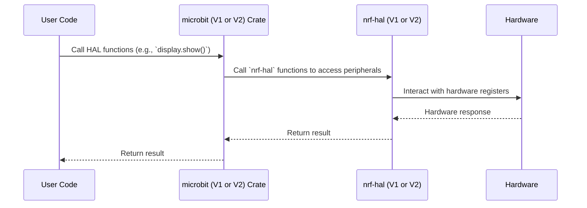

# Chapter 1: microbit V1 and V2 Crates

Welcome to the `microbit` project! This tutorial series will guide you through the codebase, equipping you with the knowledge to contribute effectively. We'll start with the fundamental concept of the `microbit` and `microbit-v2` crates.

## Motivation: Supporting Two Micro:bit Versions

The BBC micro:bit has two major hardware versions: V1 and V2. These versions have different microcontrollers (Nordic nRF51822 for V1 and nRF52833 for V2) and peripherals. To support both, the `microbit` project is split into two separate crates: `microbit` for V1 and `microbit-v2` for V2.

**Use Case:** Imagine you want to write a simple program that blinks an LED on the micro:bit. The code for controlling the LED is different between V1 and V2 due to hardware differences. Using the correct crate ensures that your code will work correctly on the intended micro:bit version.

## Key Concepts

1.  **Crate Separation:** The core idea is that the `microbit` crate targets the V1 board (architecture `thumbv6m-none-eabi`), while the `microbit-v2` crate targets the V2 board (`thumbv7em-none-eabihf`).

2.  **Hardware Abstraction Layer (HAL):** Each crate provides a HAL built upon the `nrf-hal` crate. This HAL exposes peripherals like the LED display, buttons, accelerometer, and magnetometer.  A HAL simplifies interactions with the hardware, providing a consistent interface regardless of low-level hardware differences.  We will discuss the [HAL (Hardware Abstraction Layer)](05_hal__hardware_abstraction_layer__.md) in more detail later.

3.  **Version-Specific Functionality:** Each crate contains code specific to its target micro:bit version. This ensures accurate hardware interaction and allows for leveraging unique features of each board.

4. **Target Specification:** Rust utilizes target triple to determine the architecture. `thumbv6m-none-eabi` refers to micro:bit V1 and `thumbv7em-none-eabihf` indicates micro:bit V2.

## Using the Crates

To use the crates, you need to specify the correct dependency in your `Cargo.toml` file and select the appropriate target.

**Example: `Cargo.toml` for micro:bit V1**

```toml
[dependencies]
microbit = { version = "0.15.1" } # Use the version according to the latest release

[target.'cfg(target_arch = "arm")'.dependencies]
panic-halt = "0.2.0"

[profile.release]
codegen-units = 1 # Reduce memory usage
lto = true        # Enable link-time optimization
opt-level = "z"   # Optimize for size
```

*Explanation:* This `Cargo.toml` specifies the `microbit` crate as a dependency. The `panic-halt` crate is also included which is used to halt execution when a panic occurs.  The `profile.release` section configures the release build for optimal size.

**Example: `Cargo.toml` for micro:bit V2**

```toml
[dependencies]
microbit-v2 = { version = "0.15.1" } # Use the version according to the latest release

[target.'cfg(target_arch = "arm")'.dependencies]
panic-halt = "0.2.0"

[profile.release]
codegen-units = 1
lto = true
opt-level = "z"
```

*Explanation:*  This is similar to the V1 example, but it uses the `microbit-v2` crate. The `panic-halt` crate and `profile.release` configurations are the same.

**Code Example: Blinking an LED (Simplified)**

Here's a simplified example of how to blink an LED using either crate.  We'll focus on the parts that are different between V1 and V2, skipping over setup details for brevity.

```rust
// Common setup (device peripherals, etc.) would go here

#[cfg(feature = "v1")]
mod v1 {
    use microbit::hal::gpio;
    use microbit::hal::prelude::*;

    pub fn blink(led: &mut gpio::P0_21<gpio::Output<gpio::PushPull>>) {
        led.set_high().unwrap(); // Turn LED on
        // Delay
        led.set_low().unwrap();  // Turn LED off
        // Delay
    }
}

#[cfg(feature = "v2")]
mod v2 {
    use microbit_v2::hal::gpio;
    use microbit_v2::hal::prelude::*;

    pub fn blink(led: &mut gpio::P1_10<gpio::Output<gpio::PushPull>>) {
        led.set_high().unwrap(); // Turn LED on
        // Delay
        led.set_low().unwrap();  // Turn LED off
        // Delay
    }
}

fn main() {
    // ... initialization code ...

    #[cfg(feature = "v1")]
    {
        // Initialize LED pin for v1
        // let mut led = board.display.col1; // Example: Using display matrix
        // v1::blink(&mut led);
    }

    #[cfg(feature = "v2")]
    {
        // Initialize LED pin for v2
        // let mut led = board.led_matrix.col1; // Example: Using display matrix
        // v2::blink(&mut led);
    }
    loop {}
}
```

*Explanation:*

*   The `#[cfg(feature = "v1")]` and `#[cfg(feature = "v2")]` attributes enable conditional compilation.  Code within these blocks is only compiled when the corresponding feature is enabled.  This allows us to write version-specific code within the same project.
*   The `use` statements import the necessary types from the `microbit` or `microbit-v2` crate.
*   The `blink` functions toggle the LED on and off. Note that the GPIO pin type (e.g., `gpio::P0_21` for V1, `gpio::P1_10` for V2) differs between the two versions.
*   When compiling, you'd use `cargo build --features v1 --target thumbv6m-none-eabi` for V1 and `cargo build --features v2 --target thumbv7em-none-eabihf` for V2.

*Example Output:*  The LED on the specified pin would blink repeatedly.  The specific pin and blinking behavior depend on the initialization code, which is omitted for brevity.

## Internal Implementation: Crate Structure

The `microbit` and `microbit-v2` crates share a similar internal structure. They both provide:

*   **HAL modules:** Expose peripherals like the display, buttons, accelerometer, and radio.
*   **Board struct:** A convenient struct to access all peripherals.  We will cover the [Board struct](02_board_struct_.md) in the next chapter.
*   **Example code:** Demonstrates how to use the HAL.

The key difference lies in the HAL implementation details, which are tailored to the specific hardware of each micro:bit version.



*Explanation of Sequence Diagram:*

1.  The user's code calls functions provided by either the `microbit` or `microbit-v2` crate.
2.  The `microbit` crate then uses functions provided by the corresponding `nrf-hal` crate to interact with the peripherals.
3.  The `nrf-hal` crate directly manipulates the hardware registers.
4.  The hardware responds, and the response propagates back up through the layers to the user code.

**Code Example: HAL Abstraction**

Let's examine a snippet from the `microbit-v2` crate's `src/lib.rs` file which shows how the HAL is set up.

```rust
#![no_std]

#[cfg(feature = "rt")]
extern crate panic_rtt_target;

pub use nrf52833_hal as hal;

pub mod display;
pub mod buttons;
pub mod accelerometer;
pub mod gpio;
pub mod i2c;
pub mod spi;
pub mod bluetooth;
pub mod adc;
pub mod speaker;

pub struct Board {
    pub display: display::Display,
    pub buttons: buttons::Buttons,
    pub accelerometer: accelerometer::Accelerometer,
    pub i2c1: i2c::I2c1,
    pub speaker: speaker::Speaker,
    pub pins: hal::gpio::Parts,
    pub adc: adc::ADC,
}

impl Board {
    pub fn new(peripherals: hal::pac::Peripherals, core_peripherals: hal::pac::CorePeripherals) -> Self {
        // Implementation details for initializing the board
        // (clock setup, peripheral configuration, etc.) are omitted here
        // ...
        let pins = hal::gpio::Parts::new(peripherals.P0, peripherals.P1);

        let display = display::Display::new(pins.p0_13.degrade(), pins.p0_14.degrade(), pins.p0_15.degrade(), pins.p0_16.degrade(), pins.p0_19.degrade(), pins.p0_20.degrade(), pins.p0_21.degrade(), pins.p0_22.degrade());

        let buttons = buttons::Buttons::new(pins.p0_14.degrade(), pins.p0_23.degrade());

        let i2c1 = i2c::I2c1::new(peripherals.TWIM1, pins.p0_12, pins.p0_11);

        let accelerometer = accelerometer::Accelerometer::new(i2c1);

        let speaker = speaker::Speaker::new(pins.p0_00.degrade());

        let adc = adc::ADC::new(peripherals.SAADC, core_peripherals);

        Board {
            display,
            buttons,
            accelerometer,
            i2c1,
            speaker,
            pins,
            adc,
        }
    }
}
```

*Explanation:*

*   This code defines the `Board` struct for the `microbit-v2` crate.
*   It imports the `hal` (nrf52833-hal) and re-exports it to `hal`.
*   It defines several modules for peripherals, such as `display`, `buttons`, and `accelerometer`.
*   The `Board::new()` function initializes all the peripherals and returns a `Board` instance. You can see how the pins are initialized, which vary based on the version of the micro:bit.

## Conclusion

In this chapter, you learned about the `microbit` and `microbit-v2` crates, their purpose, and how they enable support for different micro:bit versions.  You saw how conditional compilation is used to write version-specific code and how the HAL provides a consistent interface to the hardware. You now know the importance of selecting the correct crate for your target micro:bit.

In the next chapter, we will explore the [Board struct](02_board_struct_.md) in more detail, looking at how it provides a convenient way to access the various peripherals on the micro:bit.


---

Generated by [AI Codebase Knowledge Builder](https://github.com/The-Pocket/Tutorial-Codebase-Knowledge)