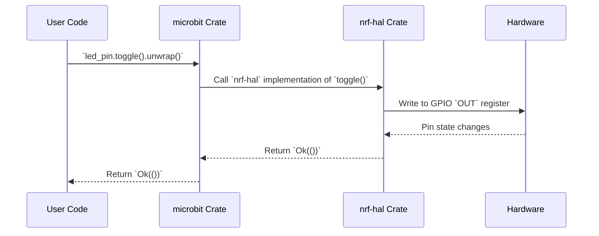

# Chapter 5: HAL (Hardware Abstraction Layer)

Following our exploration of the [GPIO Module](4.md), this chapter delves into the Hardware Abstraction Layer (HAL), the bedrock upon which the `microbit` crate is built.

## Motivation: Bridging the Gap Between Software and Hardware

Imagine you're developing a program that needs to control the LED display on the micro:bit. Without a HAL, you would need to directly interact with the microcontroller's registers. This involves understanding the specific memory addresses, bit fields, and timing requirements for each peripheral. This is tedious, error-prone, and tightly coupled to the specific microcontroller.

The HAL solves this problem by providing a high-level, abstract interface to the hardware. It encapsulates the low-level details of the microcontroller, allowing you to interact with the peripherals in a more intuitive and portable way. The `nrf-hal` crate serves as the HAL for the nRF51 (V1) and nRF52833 (V2) microcontrollers used in the micro:bit.

**Use Case:** Controlling the LED display. Instead of writing directly to memory addresses, you can use HAL functions to set the brightness of individual LEDs, draw shapes, or display text, without needing to know the underlying hardware implementation details.

## Key Concepts

1.  **Abstraction:** The HAL abstracts away the low-level details of the microcontroller, providing a high-level interface for interacting with the hardware. This includes things like:
    *   Memory addresses of registers
    *   Bit fields within registers
    *   Clock configurations
    *   Interrupt handling

2.  **Portability:** By using a HAL, your code becomes more portable. If you were to switch to a different microcontroller, you would only need to change the HAL implementation, not the application code that uses it.

3.  **Type Safety:** The `nrf-hal` crate is written in Rust, which provides strong type safety. This helps to prevent common hardware programming errors, such as writing to the wrong memory address or using the wrong data type.

4.  **Peripheral Access:** The HAL provides access to the microcontroller's peripherals, such as:
    *   GPIO (General Purpose Input/Output) pins
    *   Timers
    *   UART (Universal Asynchronous Receiver/Transmitter)
    *   SPI (Serial Peripheral Interface)
    *   I2C (Inter-Integrated Circuit)
    *   ADC (Analog-to-Digital Converter)

## Using the HAL

Let's illustrate how to use the HAL with a simplified example of toggling an LED using a GPIO pin. This example builds on the previous chapter ([GPIO Module](4.md)).

```rust
#![no_std]
#![no_main]

use panic_halt as _;

#[cfg(feature = "v1")]
use microbit::{Board, hal::{gpio::{Level, Output, PushPull}, prelude::_embedded_hal_digital_v2_OutputPin as OutputPin}}; // Import the OutputPin trait

#[cfg(feature = "v2")]
use microbit_v2::{Board, hal::{gpio::{Level, Output, PushPull}, prelude::_embedded_hal_digital_v2_OutputPin as OutputPin}}; // Import the OutputPin trait

use cortex_m_rt::entry;

#[entry]
fn main() -> ! {
    #[cfg(feature = "v1")]
    let mut board = {
        let peripherals = microbit::hal::pac::Peripherals::take().unwrap();
        let core_peripherals = cortex_m::Peripherals::take().unwrap();
        Board::new(peripherals, core_peripherals)
    };

    #[cfg(feature = "v2")]
    let mut board = {
        let peripherals = microbit_v2::hal::pac::Peripherals::take().unwrap();
        let core_peripherals = cortex_m::Peripherals::take().unwrap();
        Board::new(peripherals, core_peripherals)
    };

    // Configure the LED pin as output (using the HAL).
    #[cfg(feature = "v1")]
    let mut led_pin = board.display.col1.into_push_pull_output();

    #[cfg(feature = "v2")]
    let mut led_pin = board.led_matrix.col1.into_push_pull_output();

    loop {
        // Toggle the LED using the HAL (OutputPin trait).
        led_pin.toggle().unwrap();

        // Delay (simplified).  In a real application, you would use a proper timer.
        for _ in 0..100000 {
            core::hint::nop(); // No-op (no operation)
        }
    }
}
```

*Explanation:*

1.  We initialize the `Board` struct as described in previous chapters.
2.  We configure a GPIO pin as an output using `.into_push_pull_output()`. This function is part of the HAL and configures the pin to drive an LED.
3.  In the `loop`, we toggle the LED using `led_pin.toggle().unwrap()`.  The `toggle()` function is a method defined by the `OutputPin` trait, which is part of the `embedded-hal` crate (a common abstraction layer for embedded systems). The `nrf-hal` crate implements this trait for its GPIO pins.
4.  A simple delay loop is used to make the blinking visible.

*Example Output:* The LED connected to the specified GPIO pin will blink on and off repeatedly.

## Internal Implementation

The `microbit` crate re-exports the `nrf-hal` crate as `hal`. Let's examine some code snippets to understand how the HAL works internally.

```rust
// microbit-v2/src/lib.rs (simplified)

pub use nrf52833_hal as hal; //Re-export the nrf52833-hal as hal

pub struct Board {
    pub display: display::Display,
    pub buttons: buttons::Buttons,
    pub accelerometer: accelerometer::Accelerometer,
    pub i2c1: i2c::I2c1,
    pub speaker: speaker::Speaker,
    pub pins: hal::gpio::Parts, //HAL's gpio part
    pub adc: adc::ADC,
}

```

*Explanation:*

*   The `nrf52833_hal` crate (or `nrf51_hal` for V1) is re-exported as `hal`. This makes the HAL's API directly accessible through the `microbit` crate.
*   The `Board` struct contains a field `pins` of type `hal::gpio::Parts`. This `Parts` struct is defined in the `nrf-hal` crate and provides access to the individual GPIO pins.

Now, let's look at how the HAL is used to configure a GPIO pin as an output. This example shows how `into_push_pull_output` is implemented for micro:bit V2, based on `nrf52833-hal`. `microbit-v1` is similar, but with `nrf51-hal`.

```rust
// nrf52833-hal/src/gpio.rs (simplified)

pub struct P0_00<MODE>(P0_00Type, PhantomData<MODE>);

impl<MODE> P0_00<MODE> {
    /// Configures the pin to operate as a push pull output pin
    pub fn into_push_pull_output(self) -> P0_00<Output<PushPull>> {
        unsafe { (*pac::GPIO::ptr()).pin_cnfg[0].write(|w| w
            .dir().output()
            .input().disconnect()
            .pull().disabled()
            .drive().s0s1()
            .sense().disabled()) };
        P0_00(self.0, PhantomData)
    }
}
```

*Explanation:*

*   The `into_push_pull_output()` function configures the GPIO pin as a push-pull output.
*   It uses unsafe code to directly access the microcontroller's `GPIO` registers (memory-mapped peripherals).
*   The `pin_cnfg` register controls the configuration of each GPIO pin.  The code writes to this register to set the pin direction (output), disable the input buffer, disable the pull-up/pull-down resistor, set the drive strength, and disable sense mode.
*   The function returns a new `P0_00` struct with the `Output<PushPull>` mode, indicating that the pin is now configured as a push-pull output.

Finally, let's examine how the `OutputPin` trait is implemented for the GPIO pin.

```rust
// nrf52833-hal/src/gpio.rs (simplified)

impl<MODE> OutputPin for P0_00<Output<MODE>> {
    type Error = Infallible;

    /// Drives the pin low
    fn set_low(&mut self) -> Result<(), Self::Error> {
        unsafe { (*pac::GPIO::ptr()).outclr.write(|w| w.bits(1 << 0)) };
        Ok(())
    }

    /// Drives the pin high
    fn set_high(&mut self) -> Result<(), Self::Error> {
        unsafe { (*pac::GPIO::ptr()).outset.write(|w| w.bits(1 << 0)) };
        Ok(())
    }
}

impl<MODE> ToggleableOutputPin for P0_00<Output<MODE>> {
    type Error = Infallible;

    fn toggle(&mut self) -> Result<(), Self::Error> {
        unsafe { (*pac::GPIO::ptr()).out.write(|w| w.bits(1 << 0)) };
        Ok(())
    }
}
```

*Explanation:*

*   The `OutputPin` trait is implemented for the `P0_00` struct when it is in `Output` mode.
*   The `set_low()` and `set_high()` functions write to the `outclr` and `outset` registers, respectively, to set the pin's voltage level low or high.
*   The `toggle()` function write to the `out` register, to toggle the pin's voltage level.
*   Again, unsafe code is used to directly access the microcontroller's registers.



*Explanation of Sequence Diagram:*

1.  The user's code calls the `toggle()` function on the `led_pin` object.
2.  The `microbit` crate calls the `nrf-hal` implementation of `toggle()`.
3.  The `nrf-hal` implementation writes to the GPIO `OUT` register to toggle the pin's state.
4.  The hardware changes the pin state, and the response propagates back up through the layers to the user code.

## Contributing Code

Now that you understand the HAL, you're ready to contribute code to the `microbit` project. Here's a potential contribution opportunity:

**Challenge:** Implement a function that configures a GPIO pin to generate a PWM (Pulse Width Modulation) signal.

Here's how you might approach this challenge:

1.  **Explore the Timer/Counter peripheral:** The `nrf-hal` crate provides access to the microcontroller's Timer/Counter peripherals. These peripherals can be used to generate PWM signals.
2.  **Configure the Timer/Counter:** Configure a Timer/Counter to generate a PWM signal with a specific frequency and duty cycle. This involves setting the timer's prescaler, compare values, and output mode.
3.  **Connect the Timer/Counter output to a GPIO pin:** Use the microcontroller's pin routing capabilities to connect the Timer/Counter output to a specific GPIO pin.
4.  **Write a function to control the duty cycle:** Write a function that takes a duty cycle value (e.g., 0-100%) as input and updates the Timer/Counter's compare value to change the PWM signal's duty cycle.

Remember to follow the existing code style and include comments to explain your code. Test your code thoroughly before submitting a pull request.

## Conclusion

In this chapter, you learned about the HAL, its purpose, and how it simplifies hardware programming. You saw how the HAL abstracts away the low-level details of the microcontroller, providing a high-level interface for interacting with the peripherals. You also learned how the `microbit` crate re-exports the `nrf-hal` crate and how the HAL is used to configure GPIO pins and control their state. Finally, you were presented with a challenge to contribute code to the `microbit` project.

In the next chapter, we will explore [RTIC (Real-Time Interrupt-driven Concurrency) Integration](6.md), learning how to write concurrent and real-time applications for the micro:bit.


---

Generated by [AI Codebase Knowledge Builder](https://github.com/The-Pocket/Tutorial-Codebase-Knowledge)