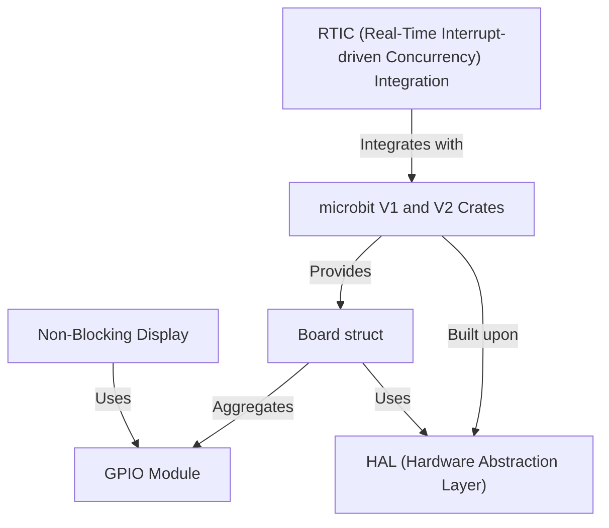

# Tutorial: microbit

The `microbit` project provides **hardware abstraction** for the BBC micro:bit V1 and V2 boards, offering a user-friendly interface for interacting with the board's peripherals. It utilizes a *Hardware Abstraction Layer (HAL)* based on `nrf-hal`, and integrates with *RTIC* for concurrent programming, and provides a *non-blocking display* for interactive applications and a dedicated *GPIO module* for pin management. The project is structured into separate crates for each micro:bit version. The `Board` struct provides central access to the micro:bit's hardware.

**Source Repository:** [None](None)

## Chapters

1. [microbit V1 and V2 Crates
](1.md)
2. [Board struct
](2.md)
3. [Non-Blocking Display
](3.md)
4. [GPIO Module
](4.md)
5. [HAL (Hardware Abstraction Layer)
](5.md)
6. [RTIC (Real-Time Interrupt-driven Concurrency) Integration
](6.md)

---

Generated by [AI Codebase Knowledge Builder](https://github.com/The-Pocket/Tutorial-Codebase-Knowledge)